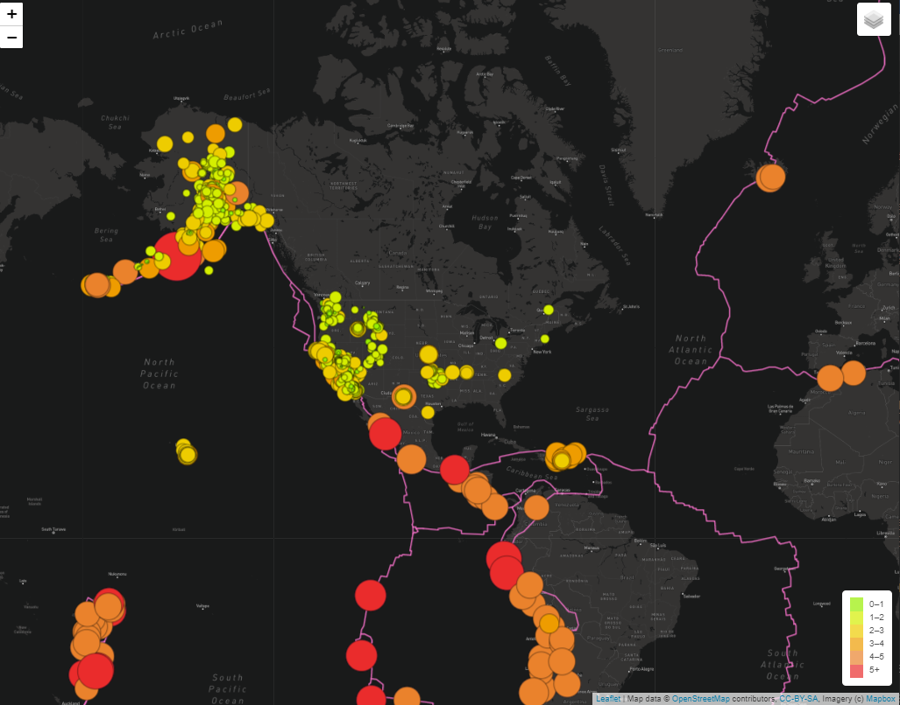

# Mapping_Earthquakes

## Overview
The head of the earthquake disaster response team at nonprofit organization Disaster Reporting Network wants to make informative earthquake maps.  I was tasked with retrieving earthquake and tectonic plate data and plotting it onto a world map.  The map should allow different layers of data (e.g. earth quakes color coded by magnitude or tectonic plate boundaries) to be toggled on and off.  Furthermore, the map should provide different background views (e.g. street view or satellite view).

## Tools
`Javascript` with `D3.js` and `leaflet`

Techtonic plate GeoJSON data from Hugo Ahlenius, Nordpil and Peter Bird: https://github.com/fraxen/tectonicplates

## Preview
Note: this code requires an api key from mapbox

